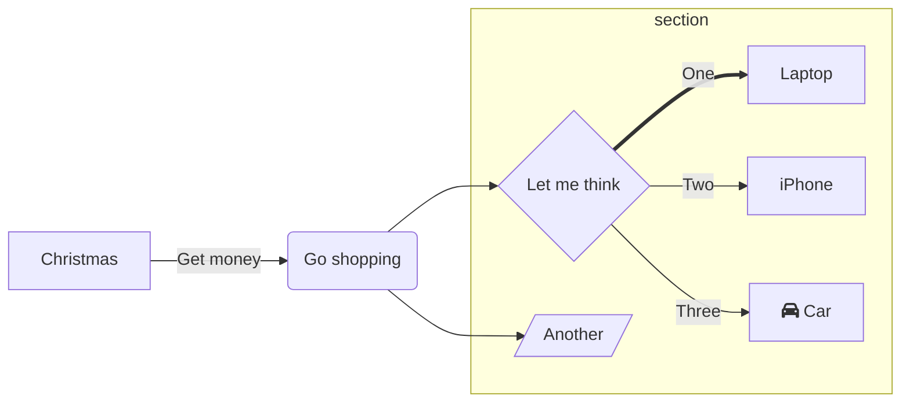
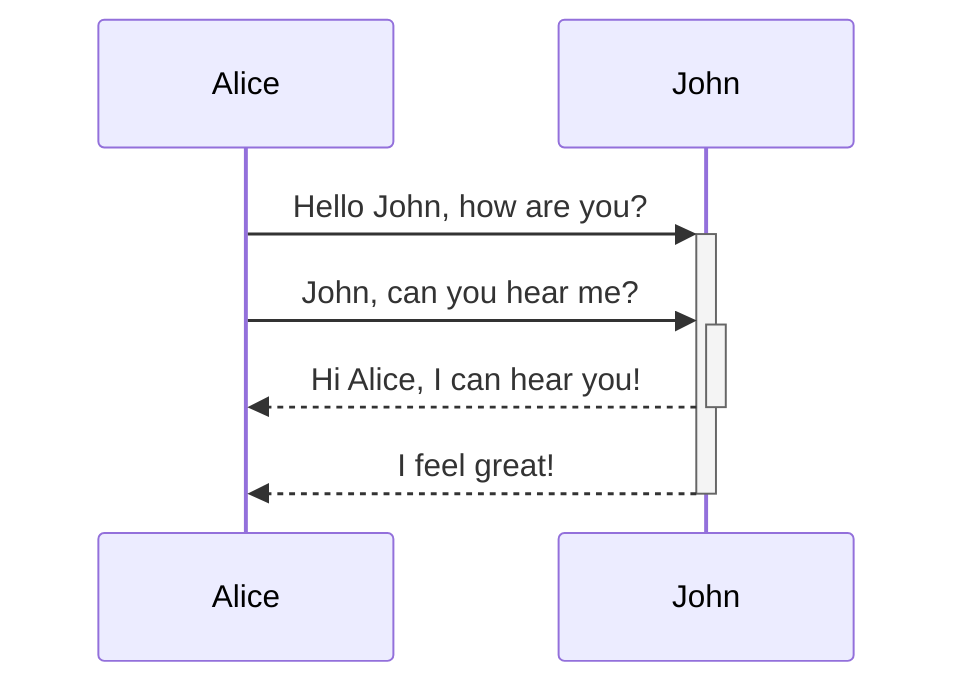
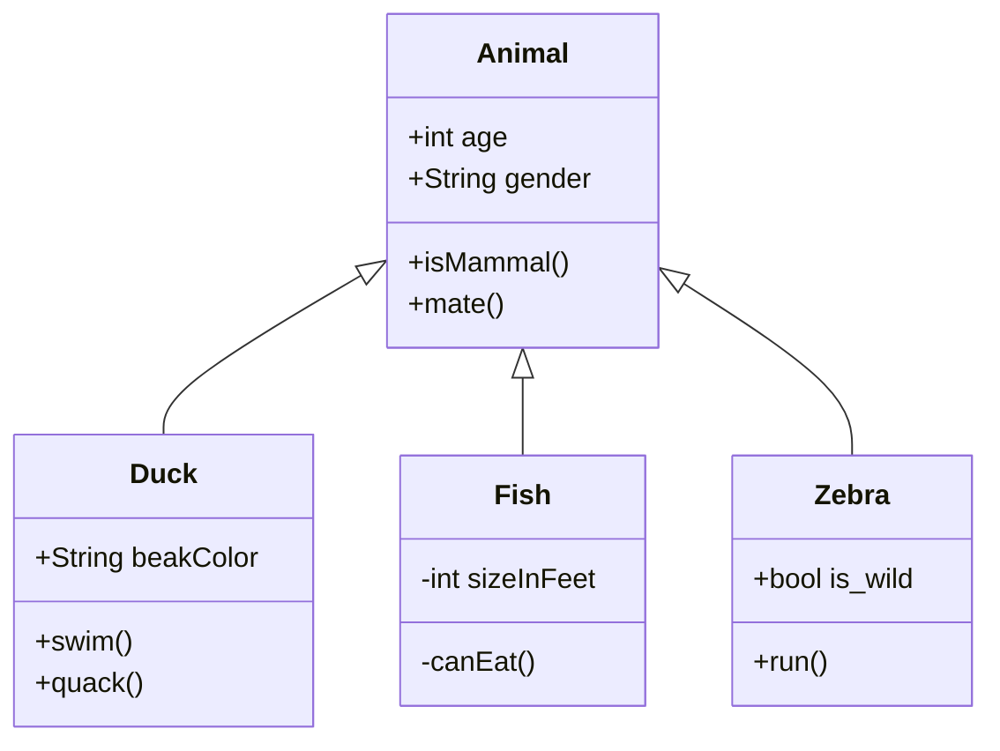
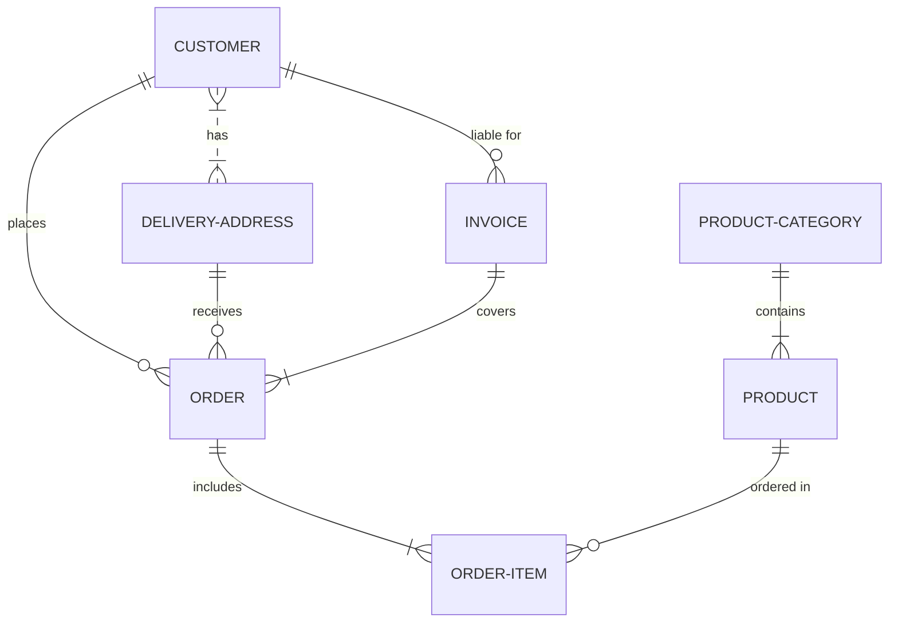

# Terraforming Theme

Presentation slides for developers

---

<Toc />

---
layout: section
---

# Section

Used to mark the beginning of a new presentation section.

---
layout: statement
---

# Statement

Make an affirmation/statement as the main page content.

---

# Code

Use code snippets and get the highlighting directly!

```ts
interface User {
  id: number
  firstName: string
  lastName: string
  role: string
}

function updateUser(id: number, update: Partial<User>) {
  const user = getUser(id)
  const newUser = { ...user, ...update }
  saveUser(id, newUser)
}
```

---

# Mermaid



---
layout: center
---



---
layout: center
---



---
layout: center
---



---
layout: center
class: "text-center"
---

# Learn More

[GitHub Repo](https://github.com/elct9620/slidev-theme-terraforming)
