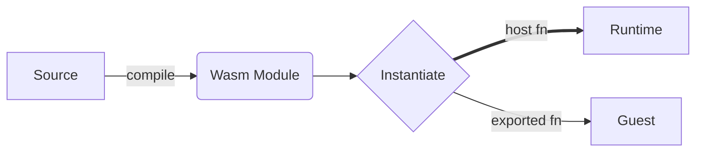
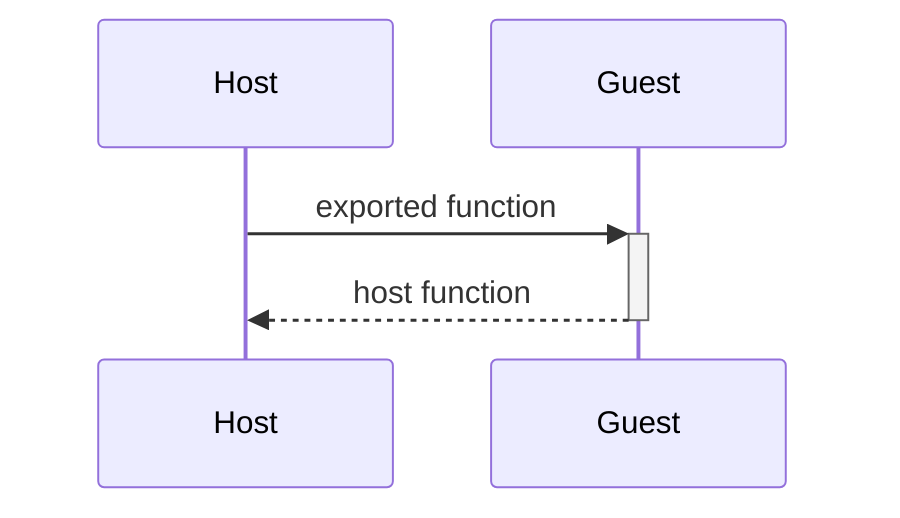

# Terraforming Theme

Presentation slides for developers

---
layout: center
hideInToc: true
---

<About>
https://blog.aotoki.me/<br />
@elct9620
</About>

---
hideInToc: true
---

<Toc />

---
layout: section
---

# Layouts

Every layout draws from the same five-step type scale

---

# Default

Content starts at the top edge and flows down

- The heading is one step below the chapter size
- The line under it takes the primary colour
- Everything else sits on the body step

---
layout: statement
hideInToc: true
---

# Statement

Make an affirmation as the whole of the page

---
layout: intro
hideInToc: true
---

# Intro

Opens a talk the way cover does, with room for a subtitle long enough that it wraps onto a second line and still reads as one paragraph

---
layout: center
hideInToc: true
---

# Center

Centred on both axes, for a page with one thing to say

---
hideInToc: true
---

# Tokens

The palette and the type scale are also available as utilities

<div class="flex gap-8">
  <div class="bg-gunJyo-500 text-white text-sub p-8">bg-gunJyo-500</div>
  <div class="bg-tamago-500 text-kon-500 text-sub p-8">bg-tamago-500</div>
  <div class="bg-jinZamOmi-500 text-white text-sub p-8">bg-jinZamOmi-500</div>
</div>

<p class="text-note text-neutral mt-12">On a 1920 canvas a Figma px divided by 4 is the spacing number, so 72 is p-18</p>

---
layout: section
---

# Diagrams

One visual language: fill, focus, stroke, absence

---
layout: diagram
hideInToc: true
---

<Stage>
  <Block name="proxy" color="tamago">Proxy</Block>

  <Stroke
    name="wire"
    :dir="$clicks === 3 ? 'left' : 'right'"
    :label="$clicks === 1 ? 'call' : $clicks === 3 ? 'result' : ''"
    :labels="['call', 'result']"
  />

  <Block name="object" color="gunJyo">Object</Block>

  <Focus :steps="['object', 'proxy', 'object', 'proxy']" />
</Stage>

<Caption>
<v-switch>
<template #0><span>The real <strong>object</strong> lives on the far side.</span></template>
<template #1><span>Calling the proxy sends the request <strong>across the wire</strong>.</span></template>
<template #2><span>The work happens <strong>where the object is</strong>.</span></template>
<template #3><span>Only the <strong>result</strong> comes back; the object never moved.</span></template>
</v-switch>
</Caption>

---
layout: diagram
hideInToc: true
---

<Stage fit>
  <Group name="pool">
    <Block name="template" color="gunJyo">Template</Block>
    <Block name="a" color="gunJyo">Instance</Block>
    <Block name="b" color="gunJyo">Instance</Block>
  </Group>

  <Stroke dir="right" label="spawn" :hidden="$clicks < 2" />

  <Block name="sandbox" color="tamago" :hidden="$clicks < 2">Sandbox</Block>

  <Focus :steps="['template', 'pool', ['template', 'sandbox']]" />
</Stage>

<Caption>
<v-switch>
<template #0><span>The frame starts on the template alone.</span></template>
<template #1><span>It grows to say these are <strong>one thing</strong>, not three.</span></template>
<template #2><span>It travels and resizes — it never cuts to a new box.</span></template>
</v-switch>
</Caption>

---
layout: diagram
hideInToc: true
---

<Stage column>
  <Block color="gunJyo">Host</Block>
  <Stroke dir="both-y" label="host functions" />
  <Block color="tamago">Guest</Block>
</Stage>

<Caption>
<span>A column stage with a vertical arrow; the label sits beside the line.</span>
</Caption>

---
hideInToc: true
---

# Bars

The row under discussion takes the same red frame as a block

<Bars
  :items="[
    { label: 'Process', value: 1200, text: '1.2 ms', via: 'fork' },
    { label: 'Container', value: 220, text: '220 μs', via: 'namespace' },
    { label: 'WebAssembly', value: 12, text: '12 μs', via: 'linear memory' },
  ]"
  :steps="[null, 'Process', 'Container', 'WebAssembly']"
/>

---
hideInToc: true
---

# Log Scale

Spanning orders of magnitude, so both ends of the axis are labelled

<Bars
  log
  axis-start="1 μs"
  axis-end="10 ms"
  :items="[
    { label: 'Process', value: 1200, text: '1.2 ms' },
    { label: 'Container', value: 220, text: '220 μs' },
    { label: 'WebAssembly', value: 12, text: '12 μs' },
  ]"
/>

---
hideInToc: true
---

# Axis

For a row that is a spectrum rather than a set of options

<Axis start-label="Fully isolated" end-label="Fully permissive" />

---
hideInToc: true
---

# Map

Two measures at once, showing a combination rather than a single winner

<Map2D
  x-start="Hard to use"
  x-end="Easy to use"
  y-start="Weak isolation"
  y-end="Strong isolation"
  :points="[
    { label: 'eval', x: 88, y: 4 },
    { label: 'Container', x: 30, y: 62 },
    { label: 'WebAssembly', x: 66, y: 80, tone: 'gunJyo' },
  ]"
  :steps="[null, 'eval', 'Container', 'WebAssembly']"
/>

---
layout: section
---

# Content

---

# Code

Code is content here, so it carries no background, radius or padding

```ts
interface User {
  id: number
  firstName: string
  lastName: string
  role: string
}

function updateUser(id: number, update: Partial<User>) {
  const user = getUser(id)
  const newUser = { ...user, ...update }
  saveUser(id, newUser)
}
```

---

# Mermaid


```mermaid
graph LR
  A[Source] -->|compile| B(Wasm Module)
  B --> C{Instantiate}
  C ==>|host fn| D[Runtime]
  C -->|exported fn| E[Guest]
```

---
layout: center
hideInToc: true
---


```mermaid
sequenceDiagram
    Host->>+Guest: exported function
    Guest-->>-Host: host function
```

---
layout: center
class: text-center
hideInToc: true
---

# Learn More

[GitHub Repo](https://github.com/elct9620/slidev-theme-terraforming)
