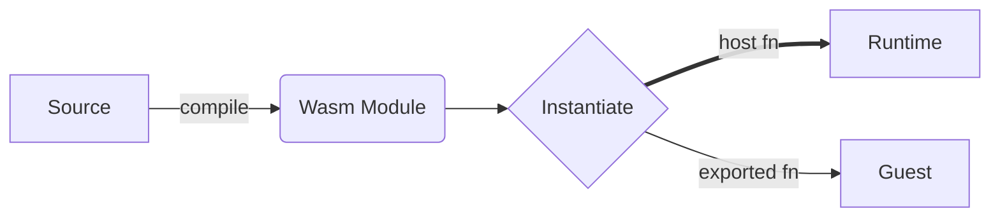
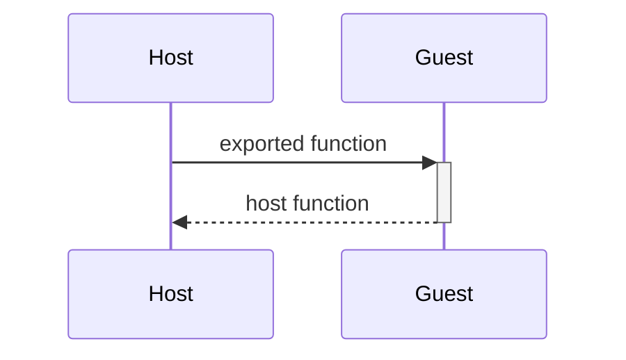

# Terraforming Theme

Presentation slides for developers

---
layout: center
hideInToc: true
---

<About>
  <Name>蒼時弦也</Name>
  <Title>Associate Software Architect</Title>
  <Title>Software Architect</Title>
  <Contact>https://blog.aotoki.me/</Contact>
  <Contact>@elct9620</Contact>
</About>

---
hideInToc: true
---

<Toc />

---
layout: section
---

# Layouts

Every layout draws from the same five-step type scale

---

# Default

Content starts at the top edge and flows down

- The heading is one step below the chapter size
- The line under it takes the primary colour
- Everything else sits on the body step

---
layout: statement
hideInToc: true
---

# Statement

Make an affirmation as the whole of the page

---
layout: intro
hideInToc: true
---

# Intro

Opens a talk the way cover does, with room for a subtitle long enough that it wraps onto a second line and still reads as one paragraph

---
layout: center
hideInToc: true
---

# Center

Centred on both axes, for a page with one thing to say

---
hideInToc: true
---

# Tokens

The palette and the type scale are also available as utilities

<div class="flex gap-8">
  <div class="bg-gunJyo-500 text-white text-sub p-8">bg-gunJyo-500</div>
  <div class="bg-tamago-500 text-kon-500 text-sub p-8">bg-tamago-500</div>
  <div class="bg-jinZamOmi-500 text-white text-sub p-8">bg-jinZamOmi-500</div>
</div>

<p class="text-note text-neutral mt-12">On a 1920 canvas a Figma px divided by 4 is the spacing number, so 72 is p-18</p>

---
layout: section
---

# Diagrams

One visual language: fill, focus, stroke, absence

---
layout: diagram
hideInToc: true
---

<Stage>
  <Block name="proxy" color="tamago">Proxy</Block>

  <Stroke
    name="wire"
    :dir="$clicks === 3 ? 'left' : 'right'"
    :label="$clicks === 1 ? 'call' : $clicks === 3 ? 'result' : ''"
    :labels="['call', 'result']"
  />

  <Block name="object" color="gunJyo">Object</Block>

  <Focus :steps="['object', 'proxy', 'object', 'proxy']" />
</Stage>

<Caption>
  <Line>The real <strong>object</strong> lives on the far side.</Line>
  <Line>Calling the proxy sends the request <strong>across the wire</strong>.</Line>
  <Line>The work happens <strong>where the object is</strong>.</Line>
  <Line>Only the <strong>result</strong> comes back; the object never moved.</Line>
</Caption>

---
layout: diagram
hideInToc: true
---

<Stage fit>
  <Group name="pool">
    <Block name="template" color="gunJyo">Template</Block>
    <Block name="a" color="gunJyo">Instance</Block>
    <Block name="b" color="gunJyo">Instance</Block>
  </Group>

  <Stroke dir="right" label="spawn" :hidden="$clicks < 2" />

  <Block name="sandbox" color="tamago" :hidden="$clicks < 2">Sandbox</Block>

  <Focus :steps="['template', 'pool', ['template', 'sandbox']]" />
</Stage>

<Caption>
  <Line>The frame starts on the template alone.</Line>
  <Line>It grows to say these are <strong>one thing</strong>, not three.</Line>
  <Line>It travels and resizes — it never cuts to a new box.</Line>
</Caption>

---
layout: diagram
hideInToc: true
---

<Stage column>
  <Group>
    <Block name="source" color="tamago">Source</Block>
    <Stroke dir="right" label="compile" />
    <Block name="module" color="gunJyo">Module</Block>
  </Group>

  <Stroke dir="down" label="instantiate" />

  <Group name="instances">
    <Block color="gunJyo">Instance</Block>
    <Block color="gunJyo">Instance</Block>
    <Block color="gunJyo">Instance</Block>
  </Group>

  <Focus :steps="['source', 'module', 'instances']" />
</Stage>

<Caption>A narrower row sits centred over the widest one, and the frame follows it there.</Caption>

---
layout: diagram
hideInToc: true
---

<Stage column>
  <Block color="gunJyo">Host</Block>
  <Stroke dir="both-y" label="host functions" />
  <Block color="tamago">Guest</Block>
</Stage>

<Caption>A column stage with a vertical arrow; the label sits beside the line.</Caption>

---
layout: diagram
hideInToc: true
---

<Stage column gap="4.5rem">
  <Group name="sandbox" gap="1.5rem">
    <Block name="guest" color="tamago" sub="untrusted">Guest</Block>
    <Block color="gray" sub="linear memory">Memory</Block>
  </Group>

  <Stroke dir="up" label="trap" flip length="9rem" />

  <Block name="host" color="gunJyo">Host</Block>

  <Focus of="sandbox" color="gunJyo" />
  <Focus :steps="[null, 'guest', 'host']" />
</Stage>

<Caption>
  <Line>A second frame says what belongs to <strong>one layer</strong> for the whole page.</Line>
  <Line>The red one is what is being spoken about <strong>right now</strong>.</Line>
  <Line>It leaves the layer; the blue frame stays where it was.</Line>
</Caption>

---
hideInToc: true
---

# Bars

The row under discussion takes the same red frame as a block

<Bars
  :items="[
    { label: 'Process', value: 1200, text: '1.2 ms', via: 'fork' },
    { label: 'Container', value: 220, text: '220 μs', via: 'namespace' },
    { label: 'WebAssembly', value: 12, text: '12 μs', via: 'linear memory' },
  ]"
  :steps="[null, 'Process', 'Container', 'WebAssembly']"
/>

---
hideInToc: true
---

# Log Scale

Spanning orders of magnitude, and revealed a row per click

<Bars
  log
  reveal
  axis-start="1 μs"
  axis-end="10 ms"
  :items="[
    { label: 'Process', value: 1200, text: '1.2 ms' },
    { label: 'Container', value: 220, text: '220 μs' },
    { label: 'WebAssembly', value: 12, text: '12 μs' },
  ]"
/>

---
hideInToc: true
---

# Axis

For a row that is a spectrum rather than a set of options

<Axis start="Fully isolated" end="Fully permissive" />

---
hideInToc: true
---

# Map

Two measures at once, showing a combination rather than a single winner

<Map2D
  x-start="Hard to use"
  x-end="Easy to use"
  y-start="Weak isolation"
  y-end="Strong isolation"
  :steps="[null, 'eval', 'container', 'wasm']"
>
  <Point name="eval" :x="88" :y="4">eval</Point>
  <Point name="container" :x="30" :y="62">Container</Point>
  <Point name="wasm" :x="66" :y="80" tone="gunJyo">WebAssembly</Point>
</Map2D>

---
hideInToc: true
clicks: 2
---

# Driven by the deck

A chart stepped from a `$clicks` expression says how long its page is

<Bars
  :max="2000"
  :active="$clicks - 1"
  :items="[
    { label: 'Process', value: 1200, text: '1.2 ms' },
    { label: 'Container', value: 220, text: '220 μs' },
  ]"
/>

<Caption>The bars are measured against a stated ceiling, so two charts can be compared.</Caption>

---
layout: diagram
hideInToc: true
---

<Bars
  log
  axis-start="1 μs"
  axis-end="10 ms"
  :items="[
    { label: 'Process', value: 1200, text: '1.2 ms' },
    { label: 'Container', value: 220, text: '220 μs' },
    { label: 'WebAssembly', value: 12, text: '12 μs' },
  ]"
  :steps="[null, 'WebAssembly']"
/>

<Caption>A chart on a page with no heading still spans the content width.</Caption>

---
layout: section
---

# Content

---

# Code

Code is content here, so it carries no background, radius or padding

```ts
interface User {
  id: number
  firstName: string
  lastName: string
  role: string
}

function updateUser(id: number, update: Partial<User>) {
  const user = getUser(id)
  const newUser = { ...user, ...update }
  saveUser(id, newUser)
}
```

---

# Mermaid


```mermaid
graph LR
  A[Source] -->|compile| B(Wasm Module)
  B --> C{Instantiate}
  C ==>|host fn| D[Runtime]
  C -->|exported fn| E[Guest]
```

---
layout: center
hideInToc: true
---


```mermaid
sequenceDiagram
    Host->>+Guest: exported function
    Guest-->>-Host: host function
```

---
layout: center
class: text-center
hideInToc: true
---

# Learn More

[GitHub Repo](https://github.com/elct9620/slidev-theme-terraforming)
